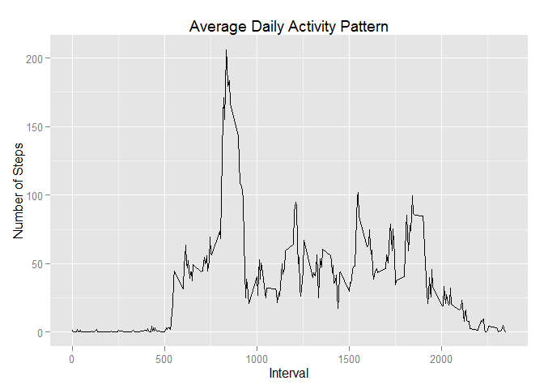

# Reproducible Research: Peer Assessment 1


## Preparing R environment  
  
  

```r
## suppressing warnings and results for this code chunck
Sys.setlocale("LC_TIME", "English")   ## to make sure that weekdays are displayed in the right format
library( ggplot2)					  ## using ggplot library to plot graphs
## using RStudio so no need to call library( knitr)
```
  
## Loading and preprocessing the data  
  
Please first set working directory to your personal working directory which should contain the activity data as a zipped file. 
  
Data will be unzipped to a 'data' directory. Data will be reformatted where needed.
  
  

```r
filePath <- "./activity.zip"
unzip( filePath, exdir="./data")

acData <- read.csv( './data/activity.csv', header = TRUE, sep = ",",
                  colClasses=c( "numeric", "character", "numeric"))
				  

acData$date <- as.Date(acData$date, format = "%Y-%m-%d")
acData$interval <- as.factor(acData$interval)
```
  
  
## What is mean total number of steps taken per day?
  
Calculate the total number of steps taken per day
  

```r
stepsDay <- aggregate(steps ~ date, acData, FUN=sum, na.rm=TRUE)
```
  
Make a histogram of the total number of steps taken each day
  
  

```r
stepsDay <- aggregate(steps ~ date, acData, FUN=sum, na.rm=TRUE)

histPlot <- ggplot( stepsDay, aes( x=steps)) + 
				geom_histogram( binwidth=1000) + 
				labs( title="Histogram of Steps Taken per Day", 
						x="Number of Steps per Day (binwidth=1000)", y="Count") 
histPlot
```

 
  
  
Calculate and report the mean and median of the total number of steps taken per day
  
  

```r
stepsMean   <- mean( stepsDay$steps, na.rm=TRUE)
stepsMedian <- median( stepsDay$steps, na.rm=TRUE)
```
  
The mean is **10766.19** and median is **10765**.
  
  
## What is the average daily activity pattern?
  
  
Make a time series plot of the 5-minute interval (x-axis) and the average number of steps taken, averaged across all days (y-axis)
  
  

```r
avgStepsInterval <- aggregate( acData$steps, by=list(acData$interval), FUN=mean, na.rm=TRUE)
colnames( avgStepsInterval) <- c( "interval", "steps")
#coerce interval to integers before plotting
avgStepsInterval$interval <- as.integer( levels( avgStepsInterval$interval)[avgStepsInterval$interval])

intervalPlot <- ggplot( avgStepsInterval, aes(x=interval, y=steps)) +   
					geom_line() +  
					labs( title="Average Daily Activity Pattern", x="Interval", y="Number of Steps")			
intervalPlot
```

 
  
  
Which 5-minute interval, on average across all the days in the dataset, contains the maximum number of steps?
  
  

```r
maxAvgSteps <- avgStepsInterval[which.max( avgStepsInterval$steps),]
```
  
The **835<sup>th</sup>** interval has **206** steps, which is the maximum for this data set.
  
  
## Imputing missing values
  
  
Calculate and report the total number of missing values in the dataset
  
  

```r
numberMissing <- sum( is.na( acData$steps))
```
  
The number of missing values is **2304**.
  
  
Devise a strategy for filling in all of the missing values in the dataset. The strategy does not need to be sophisticated. 
The strategy I chose was to replace the NA values with the average number of steps for each interval calculated earlier.  
I first set up a function that takes care of replacing the NA's which I call to create the completed data frame in the next step of the assignment.
  

```r
fillNAs <- function( data, replaceVal) {
			indexNA <- which( is.na( data$steps))
			replaceNA <- unlist( 
									lapply( indexNA, 
										FUN=function(idx){
												interval = data[idx,]$interval
												replaceVal[replaceVal$interval == interval,]$steps
											} ## FUN=function
									) ## lapply
						) ## unlist
			outputData <- data$steps
			outputData[indexNA] <- replaceNA
			outputData
}
```
  
Create a new dataset that is equal to the original dataset but with the missing data filled in.	
  
  

```r
acDataComplete <- data.frame(  
        steps = fillNAs( acData, avgStepsInterval),  
        date = acData$date,  
        interval = acData$interval)	

numberMissingComplete <- sum( is.na( acDataComplete$steps))
```

The number of missing values after replacing NA's is **0** (should be 0 (zero)).


Make a histogram of the total number of steps taken each day and Calculate and report the mean and median total number of steps taken per day. Do these values differ from the estimates from the first part of the assignment? What is the impact of imputing missing data on the estimates of the total daily number of steps?
  
  

```r
stepsDayComplete <- aggregate(steps ~ date, acDataComplete, FUN=sum, na.rm=TRUE)

histPlotComplete <- ggplot( stepsDayComplete, aes( x=steps)) + 
						geom_histogram( binwidth=1000) + 
						labs( title="Histogram of Steps Taken per Day After Replacing NA's", 
								x="Number of Steps per Day (binwidth=1000)", y="Count") 
histPlotComplete
```

 

```r
stepsMeanComplete   <- mean( stepsDayComplete$steps)
stepsMedianComplete <- median( stepsDayComplete$steps)
```
 
Before replacing the NA values, the mean was **10766.19** and median was **10765**.  
After replacing the NA values, the mean is **10766.19** and median is **10766.19**.

 
**Impact Analysis:** Replacing the NA values, increased the size of the peak in the histogram. It also increased the median slightly, leaving the mean as it was. Median and Mean are now the same.
  
  
## Are there differences in activity patterns between weekdays and weekends?
  
  
Create a new factor variable in the dataset with two levels weekday” and weekend” indicating whether a given date is a weekday or weekend day.
  
  

```r
acDataComplete$weekday <- as.factor( ifelse( weekdays( acDataComplete$date) %in% c("Saturday","Sunday"), 
														"Weekend", "Weekday")) 

avgStepsIntervalWeekday  <- aggregate( x = acDataComplete$steps , 
                                       by = list( acDataComplete$interval,acDataComplete$weekday), 
									   FUN=mean ,na.rm=TRUE)
names( avgStepsIntervalWeekday) <- c("interval","weekday","steps")													
avgStepsIntervalWeekday$interval <- as.integer( levels( avgStepsIntervalWeekday$interval)
																[avgStepsIntervalWeekday$interval])
```
  
Make a panel plot containing a time series plot of the 5-minute interval (x-axis) and the average number of steps taken, averaged across all weekday days or weekend days (y-axis).   
  
  

```r
ggplot( avgStepsIntervalWeekday, aes( interval,steps)) +
				geom_line() +
                labs( title="Time Series Plot of Average Steps by Interval after Replacing NA's",
						x="Interval", y="Number of Steps") +
                facet_grid( weekday ~ .) 
```

 

 
